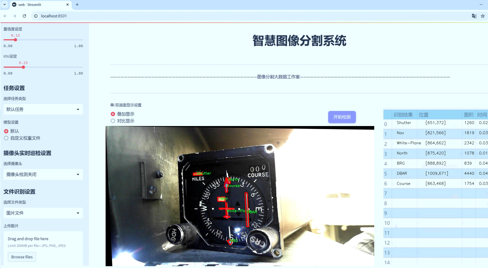
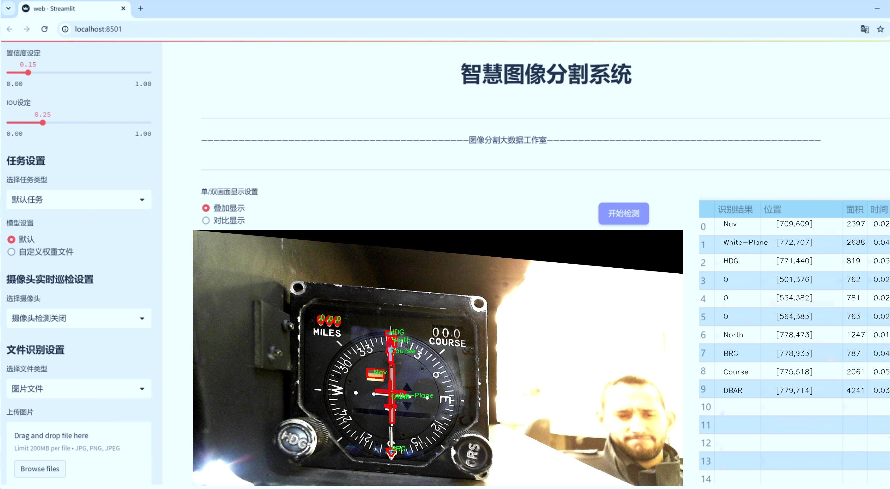
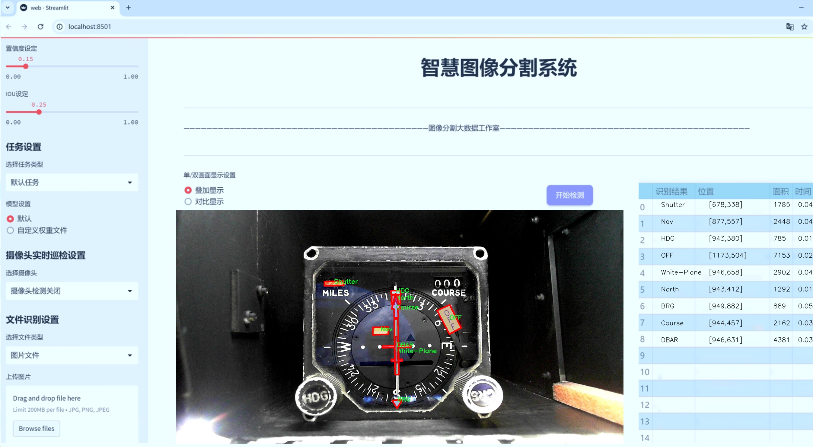
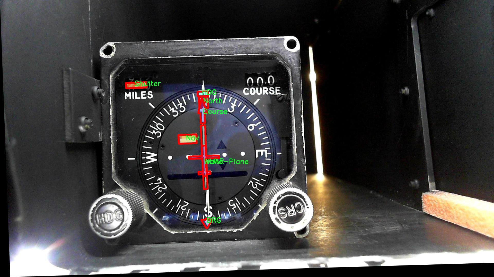
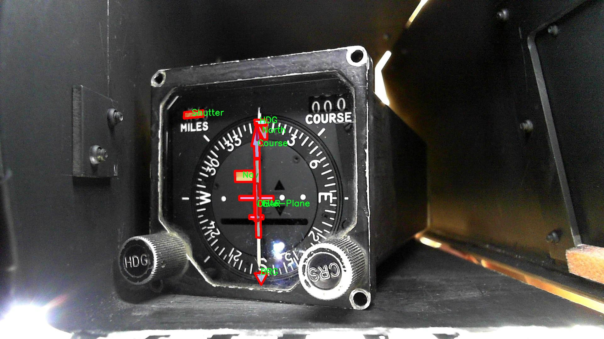
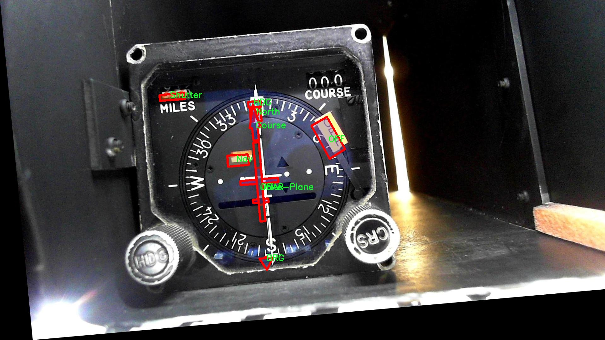
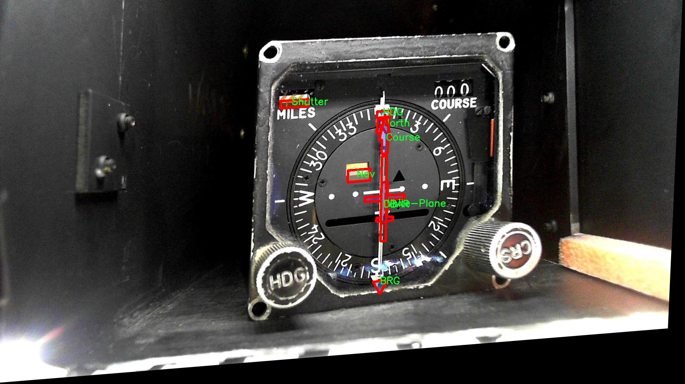
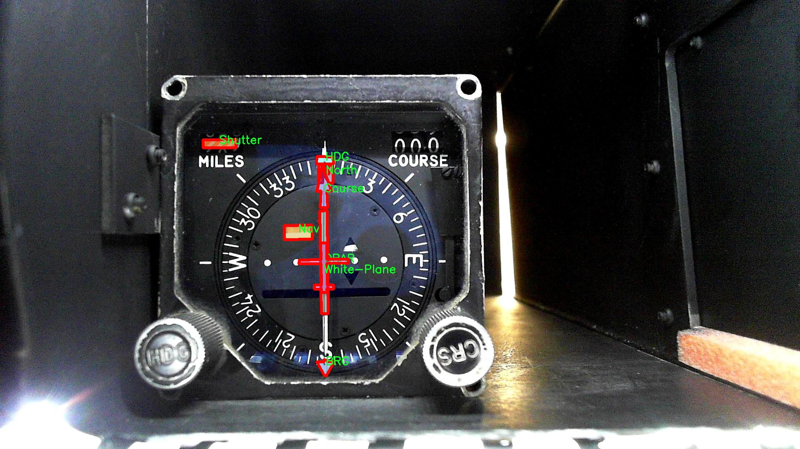

# 指针式表盘指针关键部位分割系统源码＆数据集分享
 [yolov8-seg-LSKNet＆yolov8-seg-C2f-EMSC等50+全套改进创新点发刊_一键训练教程_Web前端展示]

### 1.研究背景与意义

项目参考[ILSVRC ImageNet Large Scale Visual Recognition Challenge](https://gitee.com/YOLOv8_YOLOv11_Segmentation_Studio/projects)

项目来源[AAAI Global Al lnnovation Contest](https://kdocs.cn/l/cszuIiCKVNis)

研究背景与意义

随着智能化技术的迅速发展，图像处理和计算机视觉在各个领域的应用愈加广泛，尤其是在工业自动化、智能交通、医疗影像分析等领域。指针式表盘作为一种传统的显示设备，广泛应用于航空、航海、机械等行业，提供了重要的实时数据。然而，传统的指针式表盘在信息读取和数据处理方面存在一定的局限性，尤其是在复杂环境下，指针的识别和定位往往受到光照、角度和背景干扰的影响。因此，开发一种高效、准确的指针式表盘指针关键部位分割系统显得尤为重要。

本研究旨在基于改进的YOLOv8模型，构建一个针对指针式表盘的指针关键部位分割系统。YOLO（You Only Look Once）系列模型以其快速和高效的目标检测能力而闻名，尤其是在实时应用中表现突出。YOLOv8作为最新版本，进一步优化了模型的结构和算法，能够在保证检测精度的同时提高处理速度。通过对YOLOv8的改进，我们可以更好地适应指针式表盘的特定需求，实现对指针、刻度及其他关键部位的精准分割。

在数据集方面，本研究使用了HSI Barak RAGC1 Segmentation数据集，该数据集包含1600张图像，涵盖23个类别，包括指针、刻度、背景等多种元素。这一丰富的数据集为模型的训练和验证提供了坚实的基础。通过对这些图像的深入分析和处理，我们能够提取出指针式表盘的关键特征，从而提高模型的识别和分割能力。此外，数据集中多样化的类别设置使得模型能够在不同的场景和条件下进行有效的学习和适应，增强了系统的鲁棒性。

本研究的意义不仅在于技术上的创新，更在于其实际应用价值。通过实现高效的指针式表盘指针关键部位分割系统，可以极大地提高数据读取的自动化程度，降低人工干预的需求，进而提升工作效率和安全性。在航空、航海等领域，准确的指针识别和数据处理能够为决策提供及时、可靠的信息支持，减少人为错误的发生。此外，该系统的成功应用还可以为其他类型的仪表盘数据处理提供借鉴，推动相关领域的智能化发展。

综上所述，基于改进YOLOv8的指针式表盘指针关键部位分割系统的研究，不仅具有重要的理论价值，也具有广泛的应用前景。通过对现有技术的改进和数据集的有效利用，我们期望能够在指针式表盘的自动识别和数据处理领域取得突破，为相关行业的智能化转型贡献力量。

### 2.图片演示







##### 注意：由于此博客编辑较早，上面“2.图片演示”和“3.视频演示”展示的系统图片或者视频可能为老版本，新版本在老版本的基础上升级如下：（实际效果以升级的新版本为准）

  （1）适配了YOLOV8的“目标检测”模型和“实例分割”模型，通过加载相应的权重（.pt）文件即可自适应加载模型。

  （2）支持“图片识别”、“视频识别”、“摄像头实时识别”三种识别模式。

  （3）支持“图片识别”、“视频识别”、“摄像头实时识别”三种识别结果保存导出，解决手动导出（容易卡顿出现爆内存）存在的问题，识别完自动保存结果并导出到tempDir中。

  （4）支持Web前端系统中的标题、背景图等自定义修改，后面提供修改教程。

  另外本项目提供训练的数据集和训练教程,暂不提供权重文件（best.pt）,需要您按照教程进行训练后实现图片演示和Web前端界面演示的效果。

### 3.视频演示

[3.1 视频演示](https://www.bilibili.com/video/BV1Qm27YoEkg/)

### 4.数据集信息展示

##### 4.1 本项目数据集详细数据（类别数＆类别名）

nc: 23
names: ['0', '1', '2', '3', '4', '5', '6', '7', '8', '9', 'BRG', 'Course', 'DBAR', 'DF', 'From', 'HDG', 'Nav', 'North', 'OFF', 'Shutter', 'South', 'To', 'White-Plane']


##### 4.2 本项目数据集信息介绍

数据集信息展示

在现代计算机视觉领域，尤其是在物体检测和分割任务中，数据集的质量和多样性对模型的性能起着至关重要的作用。本研究所使用的数据集名为“HSI Barak RAGC1 Segmentation”，专门用于训练和改进YOLOv8-seg模型，以实现对指针式表盘指针关键部位的精确分割。该数据集的设计旨在捕捉和标注与指针式表盘相关的多种元素，涵盖了23个不同的类别，为模型提供了丰富的学习素材。

在这个数据集中，类别的划分非常细致，涵盖了从数字到功能指示的多种元素。具体而言，类别列表包括了数字‘0’到‘9’，以及其他功能性标识如‘BRG’（可能代表某种基准参考点）、‘Course’（航向）、‘DBAR’（深度条）、‘DF’（方向指示）、‘From’（起始点）、‘HDG’（航向角）、‘Nav’（导航指示）、‘North’（北方指示）、‘OFF’（关闭状态）、‘Shutter’（快门状态）、‘South’（南方指示）、‘To’（目标点）和‘White-Plane’（白色平面）。这些类别的多样性使得数据集能够覆盖指针式表盘的各个方面，为模型的训练提供了全面的视角。

数据集的构建过程不仅关注类别的多样性，还强调了标注的准确性和一致性。每个类别的样本均经过精细的标注，确保在训练过程中，模型能够学习到每个类别的特征和位置。这种高质量的标注对于提高模型的分割精度至关重要，尤其是在复杂的视觉场景中，指针和指示器的重叠可能会导致模型混淆。

此外，数据集的规模和样本数量也是影响模型性能的重要因素。通过对大量不同场景下的指针式表盘进行采集和标注，数据集“HSI Barak RAGC1 Segmentation”为YOLOv8-seg模型提供了丰富的训练数据。这种多样化的训练数据不仅有助于模型在特定任务上的表现，还能提高其在未见数据上的泛化能力。

在实际应用中，经过训练的YOLOv8-seg模型能够在指针式表盘的关键部位上实现高效的分割，进而为后续的分析和决策提供支持。无论是在航海、航空还是其他需要精确读取指示信息的领域，该模型的应用都将极大地提升工作效率和安全性。

综上所述，“HSI Barak RAGC1 Segmentation”数据集不仅在类别数量和多样性上表现出色，更在标注质量和样本丰富性方面为YOLOv8-seg模型的训练提供了坚实的基础。这一数据集的构建和应用，将为指针式表盘的智能识别和分析开辟新的可能性，推动相关领域的技术进步。











### 5.全套项目环境部署视频教程（零基础手把手教学）

[5.1 环境部署教程链接（零基础手把手教学）](https://www.bilibili.com/video/BV1jG4Ve4E9t/?vd_source=bc9aec86d164b67a7004b996143742dc)


[5.2 安装Python虚拟环境创建和依赖库安装视频教程链接（零基础手把手教学）](https://www.bilibili.com/video/BV1nA4VeYEze/?vd_source=bc9aec86d164b67a7004b996143742dc)

### 6.手把手YOLOV8-seg训练视频教程（零基础小白有手就能学会）

[6.1 手把手YOLOV8-seg训练视频教程（零基础小白有手就能学会）](https://www.bilibili.com/video/BV1cA4VeYETe/?vd_source=bc9aec86d164b67a7004b996143742dc)


按照上面的训练视频教程链接加载项目提供的数据集，运行train.py即可开始训练



     Epoch   gpu_mem       box       obj       cls    labels  img_size
     1/200     0G   0.01576   0.01955  0.007536        22      1280: 100%|██████████| 849/849 [14:42<00:00,  1.04s/it]
               Class     Images     Labels          P          R     mAP@.5 mAP@.5:.95: 100%|██████████| 213/213 [01:14<00:00,  2.87it/s]
                 all       3395      17314      0.994      0.957      0.0957      0.0843

     Epoch   gpu_mem       box       obj       cls    labels  img_size
     2/200     0G   0.01578   0.01923  0.007006        22      1280: 100%|██████████| 849/849 [14:44<00:00,  1.04s/it]
               Class     Images     Labels          P          R     mAP@.5 mAP@.5:.95: 100%|██████████| 213/213 [01:12<00:00,  2.95it/s]
                 all       3395      17314      0.996      0.956      0.0957      0.0845

     Epoch   gpu_mem       box       obj       cls    labels  img_size
     3/200     0G   0.01561    0.0191  0.006895        27      1280: 100%|██████████| 849/849 [10:56<00:00,  1.29it/s]
               Class     Images     Labels          P          R     mAP@.5 mAP@.5:.95: 100%|███████   | 187/213 [00:52<00:00,  4.04it/s]
                 all       3395      17314      0.996      0.957      0.0957      0.0845


### 7.50+种全套YOLOV8-seg创新点代码加载调参视频教程（一键加载写好的改进模型的配置文件）

[7.1 50+种全套YOLOV8-seg创新点代码加载调参视频教程（一键加载写好的改进模型的配置文件）](https://www.bilibili.com/video/BV1Hw4VePEXv/?vd_source=bc9aec86d164b67a7004b996143742dc)

### 8.YOLOV8-seg图像分割算法原理

原始YOLOv8-seg算法原理

YOLOv8-seg算法是YOLO系列目标检测模型的最新迭代，结合了目标检测与图像分割的能力，展现出卓越的性能和灵活性。该算法在YOLOv5的基础上进行了多项优化，旨在提升模型的准确性和计算效率，尤其是在处理复杂场景和多目标检测时。YOLOv8-seg的核心架构由三个主要部分组成：骨干特征提取网络、特征融合层和检测头层，每个部分都经过精心设计，以实现高效的特征提取和准确的目标检测。

在骨干特征提取网络层，YOLOv8-seg采用了轻量化的C2F模块，取代了传统的C3模块。C2F模块通过将输入特征图分为两个分支，分别经过卷积层进行降维，从而有效地减少了计算量。这种设计不仅提升了模型的处理速度，还增强了特征图的表达能力。每个分支的输出都被整合，形成更高维度的特征图，进而通过卷积层进行融合，确保了模型在特征提取过程中能够获得更多的梯度流信息。这种结构的引入，使得YOLOv8-seg在处理不同尺度的目标时，能够更为灵活和高效。

特征融合层是YOLOv8-seg的另一个关键组成部分，采用了特征金字塔网络（FPN）与路径聚合网络（PAN）的结合。FPN的设计使得模型能够有效地提取不同尺度的特征，而PAN则通过跨层连接，增强了特征的传递和融合能力。在此基础上，YOLOv8-seg引入了BiFPN网络，进一步提高了对不同尺度特征信息的提取速度。BiFPN的核心思想是高效的双向跨尺度连接和加权特征融合，通过简化节点结构和增强连接，提升了特征融合的效率。这种高效的特征融合机制，使得YOLOv8-seg在面对复杂背景和多目标场景时，能够保持高准确率和快速响应。

在检测头层，YOLOv8-seg采用了轻量化的解耦头，取代了传统的耦合头。这一改进使得模型能够以无锚框（Anchor-Free）的方式进行目标检测，直接预测目标的中心点和宽高比例。这种方法不仅减少了Anchor框的数量，还显著提高了检测速度和准确度。YOLOv8-seg的检测头层通过多个卷积层和全连接层，将特征图转换为目标检测结果，确保了模型在实际应用中的高效性和准确性。

YOLOv8-seg算法还引入了新的损失策略，以提升模型的训练效果。通过变焦损失计算分类损失，并使用数据平均保真度损失和完美交并比损失对边界框损失进行计算，这种策略使得YOLOv8-seg在目标检测的准确性上有了显著提升。结合新的样本匹配方式，YOLOv8-seg能够在高效率的基础上，进行更加精确的目标检测和分割。

此外，YOLOv8-seg在实际应用中展现出了极高的灵活性，能够适应多种场景和任务。无论是在复杂的城市环境中进行行人检测，还是在医疗影像中进行病灶分割，YOLOv8-seg都能凭借其高效的特征提取和融合能力，提供准确的结果。这使得YOLOv8-seg不仅适用于传统的目标检测任务，还能够扩展到更为复杂的图像分割任务中。

综上所述，YOLOv8-seg算法通过对骨干特征提取网络、特征融合层和检测头层的优化，结合新的损失策略和样本匹配方式，展现出了卓越的性能。其轻量化设计和高效的特征处理能力，使得YOLOv8-seg在目标检测和图像分割领域中，成为一种极具竞争力的解决方案。随着技术的不断进步，YOLOv8-seg有望在更多实际应用中发挥重要作用，推动目标检测和图像分割技术的发展。


### 9.系统功能展示（检测对象为举例，实际内容以本项目数据集为准）

图9.1.系统支持检测结果表格显示

  图9.2.系统支持置信度和IOU阈值手动调节

  图9.3.系统支持自定义加载权重文件best.pt(需要你通过步骤5中训练获得)

  图9.4.系统支持摄像头实时识别

  图9.5.系统支持图片识别

  图9.6.系统支持视频识别

  图9.7.系统支持识别结果文件自动保存

  图9.8.系统支持Excel导出检测结果数据


### 10.50+种全套YOLOV8-seg创新点原理讲解（非科班也可以轻松写刊发刊，V11版本正在科研待更新）

#### 10.1 由于篇幅限制，每个创新点的具体原理讲解就不一一展开，具体见下列网址中的创新点对应子项目的技术原理博客网址【Blog】：


[10.1 50+种全套YOLOV8-seg创新点原理讲解链接](https://gitee.com/qunmasj/good)

#### 10.2 部分改进模块原理讲解(完整的改进原理见上图和技术博客链接)【此小节的图要是加载失败请移步原始博客查看，链接：https://blog.csdn.net/cheng2333333?type=blog】
### YOLOv8简介
#### Yolov8网络模型
Yolov8n的网络分为输入端、主干网( Back-bone) 、Neck模块和输出端4个部分（图4)。输
人端主要有马赛克( Mosaic）数据增强、自适应锚框计算和自适应灰度填充。主干网有Conv、C2和SPPF结构，其中，C2r模块是对残差特征进行学习的主要模块，该模块仿照Yolov7的ELAN结构,通过更多的分支跨层连接，丰富了模型的梯度流，可形成一个具有更强特征表示能力的神经网络模
块。Neck模块采用PAN ( path aggregation nelwOrk ,结构，可加强网络对不同缩放尺度对象特征融合的
能力。输出端将分类和检测过程进行解耦，主要包括损失计算和目标检测框筛选，其中，损失计算过程主要包括正负样本分配策略和 Loss计算，Yolov8n 网络主要使用TaskAlignedAssignerl 10]方法，即根据分类与回归的分数加权结果选择正样本;Loss计算包括分类和回归2个分支，无Ob-jecIness分支。分类分支依然采用BCE Loss，回归分支则使用了Distribution Focal Loss!11〕和CIOU( complele inlersection over union)损失函数。

### 可扩张残差（DWR）注意力模块
当前的许多工作直接采用多速率深度扩张卷积从一个输入特征图中同时捕获多尺度上下文信息，从而提高实时语义分割的特征提取效率。 然而，这种设计可能会因为结构和超参数的不合理而导致多尺度上下文信息的访问困难。 为了降低绘制多尺度上下文信息的难度，我们提出了一种高效的多尺度特征提取方法，该方法分解了原始的单步特征提取方法方法分为两个步骤，区域残差-语义残差。 在该方法中，多速率深度扩张卷积在特征提取中发挥更简单的作用：根据第一步提供的每个简明区域形式特征图，在第二步中使用一个所需的感受野执行简单的基于语义的形态过滤 一步，提高他们的效率。 此外，扩张率和扩张卷积的容量每个网络阶段都经过精心设计，以充分利用所有可以实现的区域形式的特征图。 因此，我们分别为高层和低层网络设计了一种新颖的扩张式残差（DWR）模块和简单倒置残差（SIR）模块。


首先，该博客引入了一个Dilation-wise Residual（DWR）模块，用于提取网络高层的特征，如图2a所示。多分支结构用于扩展感受野，其中每个分支采用不同空洞率的空洞深度卷积。
然后，专门设计了一个Simple Inverted Residual（SIR）模块来提取网络低层的特征，如图2b所示。该模块仅具有3×3的微小感受野，但使用inverted bottleneck式结构来扩展通道数量，确保更强的特征提取能力。
最后，基于DWR和SIR模块，构建了一个编码器-解码器风格的网络DWRSeg，其中解码器采用了简单的类似FCN的结构。解码器使用来自最后两个阶段的强语义信息直接对特征图进行上采样，然后将它们与来自较低阶段的特征图（包含丰富的详细信息）拼接起来，以进行最终预测。


### 11.项目核心源码讲解（再也不用担心看不懂代码逻辑）

#### 11.1 ultralytics\models\sam\modules\sam.py

下面是对代码的逐文件分析，保留了最核心的部分，并添加了详细的中文注释：

```python
# 导入必要的库
from typing import List
import torch
from torch import nn

# 导入解码器和编码器
from .decoders import MaskDecoder
from .encoders import ImageEncoderViT, PromptEncoder

class Sam(nn.Module):
    """
    Sam（Segment Anything Model）旨在进行物体分割任务。它使用图像编码器生成图像嵌入，并使用提示编码器对各种类型的输入提示进行编码。然后，这些嵌入被掩码解码器用于预测物体掩码。

    属性：
        mask_threshold (float): 掩码预测的阈值。
        image_format (str): 输入图像的格式，默认为 'RGB'。
        image_encoder (ImageEncoderViT): 用于将图像编码为嵌入的主干网络。
        prompt_encoder (PromptEncoder): 编码各种类型的输入提示。
        mask_decoder (MaskDecoder): 从图像和提示嵌入中预测物体掩码。
        pixel_mean (List[float]): 用于图像归一化的均值像素值。
        pixel_std (List[float]): 用于图像归一化的标准差值。
    """
    mask_threshold: float = 0.0  # 掩码预测的阈值，初始为0.0
    image_format: str = 'RGB'  # 输入图像的格式，默认为RGB

    def __init__(
        self,
        image_encoder: ImageEncoderViT,  # 图像编码器
        prompt_encoder: PromptEncoder,  # 提示编码器
        mask_decoder: MaskDecoder,  # 掩码解码器
        pixel_mean: List[float] = (123.675, 116.28, 103.53),  # 像素均值，用于归一化
        pixel_std: List[float] = (58.395, 57.12, 57.375)  # 像素标准差，用于归一化
    ) -> None:
        """
        初始化 Sam 类，以从图像和输入提示中预测物体掩码。

        注意：
            所有的 forward() 操作已移至 SAMPredictor。

        参数：
            image_encoder (ImageEncoderViT): 用于将图像编码为图像嵌入的主干网络。
            prompt_encoder (PromptEncoder): 编码各种类型的输入提示。
            mask_decoder (MaskDecoder): 从图像嵌入和编码的提示中预测掩码。
            pixel_mean (List[float], optional): 输入图像中像素的均值，用于归一化。默认为 (123.675, 116.28, 103.53)。
            pixel_std (List[float], optional): 输入图像中像素的标准差，用于归一化。默认为 (58.395, 57.12, 57.375)。
        """
        super().__init__()  # 调用父类的初始化方法
        self.image_encoder = image_encoder  # 初始化图像编码器
        self.prompt_encoder = prompt_encoder  # 初始化提示编码器
        self.mask_decoder = mask_decoder  # 初始化掩码解码器
        # 注册均值和标准差，用于图像归一化
        self.register_buffer('pixel_mean', torch.Tensor(pixel_mean).view(-1, 1, 1), False)
        self.register_buffer('pixel_std', torch.Tensor(pixel_std).view(-1, 1, 1), False)
```

### 代码核心部分分析
1. **类定义**：`Sam` 类继承自 `nn.Module`，是一个用于物体分割的模型。
2. **属性定义**：定义了模型的主要属性，包括掩码阈值、图像格式、编码器和解码器等。
3. **初始化方法**：在初始化方法中，传入编码器和解码器的实例，并注册像素均值和标准差用于图像的归一化处理。

该文件定义了一个名为 `Sam` 的类，属于 Ultralytics YOLO 项目的一部分，主要用于对象分割任务。`Sam` 类继承自 PyTorch 的 `nn.Module`，并包含了几个关键组件来处理图像和输入提示，从而生成对象的掩码。

在类的文档字符串中，详细描述了 `Sam` 的功能和主要属性。该模型使用图像编码器生成图像嵌入，并通过提示编码器对不同类型的输入提示进行编码。这些嵌入随后被掩码解码器用于预测对象的掩码。

类中定义了几个重要的属性：
- `mask_threshold`：用于掩码预测的阈值，默认为 0.0。
- `image_format`：输入图像的格式，默认为 'RGB'。
- `image_encoder`：使用的图像编码器，类型为 `ImageEncoderViT`，用于将图像编码为嵌入。
- `prompt_encoder`：用于编码各种类型输入提示的编码器，类型为 `PromptEncoder`。
- `mask_decoder`：从图像和提示嵌入中预测对象掩码的解码器，类型为 `MaskDecoder`。
- `pixel_mean` 和 `pixel_std`：用于图像归一化的均值和标准差，分别为 (123.675, 116.28, 103.53) 和 (58.395, 57.12, 57.375)。

在 `__init__` 方法中，初始化了 `Sam` 类的实例。该方法接受图像编码器、提示编码器和掩码解码器作为参数，并可选地接受用于归一化的均值和标准差。通过调用 `super().__init__()`，初始化父类的构造函数。

此外，使用 `register_buffer` 方法将 `pixel_mean` 和 `pixel_std` 注册为模型的缓冲区，这样它们将不会被视为模型的参数，但仍会在模型的状态字典中保存。

总的来说，`Sam` 类是一个设计用于处理图像分割任务的深度学习模型，整合了图像编码、提示编码和掩码解码的功能，为后续的掩码预测提供了基础。

#### 11.2 ui.py

以下是代码中最核心的部分，并附上详细的中文注释：

```python
import sys
import subprocess

def run_script(script_path):
    """
    使用当前 Python 环境运行指定的脚本。

    Args:
        script_path (str): 要运行的脚本路径

    Returns:
        None
    """
    # 获取当前 Python 解释器的路径
    python_path = sys.executable

    # 构建运行命令，使用 streamlit 运行指定的脚本
    command = f'"{python_path}" -m streamlit run "{script_path}"'

    # 执行命令
    result = subprocess.run(command, shell=True)
    # 检查命令执行的返回码，如果不为0，表示出错
    if result.returncode != 0:
        print("脚本运行出错。")


# 实例化并运行应用
if __name__ == "__main__":
    # 指定要运行的脚本路径
    script_path = "web.py"  # 这里可以替换为实际的脚本路径

    # 调用函数运行脚本
    run_script(script_path)
```

### 注释说明：
1. **导入模块**：
   - `sys`：用于访问与 Python 解释器相关的变量和函数。
   - `subprocess`：用于创建新进程、连接到它们的输入/输出/错误管道，并获取返回码。

2. **`run_script` 函数**：
   - 功能：使用当前 Python 环境运行指定的脚本。
   - 参数：`script_path`，要运行的脚本的路径。
   - 返回值：无。

3. **获取 Python 解释器路径**：
   - `sys.executable`：获取当前 Python 解释器的完整路径。

4. **构建命令**：
   - 使用 f-string 格式化字符串，构建运行 `streamlit` 的命令。

5. **执行命令**：
   - `subprocess.run`：执行构建的命令，并返回结果。
   - `shell=True`：表示在 shell 中执行命令。

6. **检查返回码**：
   - `result.returncode`：检查命令执行后的返回码，0 表示成功，非0表示出错。

7. **主程序入口**：
   - 使用 `if __name__ == "__main__":` 确保只有在直接运行该脚本时才会执行以下代码。
   - 指定要运行的脚本路径，并调用 `run_script` 函数。

这个程序文件名为 `ui.py`，其主要功能是通过当前的 Python 环境来运行一个指定的脚本。程序首先导入了必要的模块，包括 `sys`、`os` 和 `subprocess`，以及一个自定义的路径处理模块 `abs_path`。

在 `run_script` 函数中，程序接收一个参数 `script_path`，这个参数是要运行的脚本的路径。函数内部首先获取当前 Python 解释器的路径，这通过 `sys.executable` 实现。接着，程序构建了一个命令字符串，该命令使用 `streamlit` 来运行指定的脚本。`streamlit` 是一个用于构建数据应用的框架。

构建完命令后，程序使用 `subprocess.run` 方法来执行这个命令。这个方法会在一个新的 shell 中运行命令，并等待其完成。如果命令执行后返回的状态码不为零，表示脚本运行出错，程序会打印出相应的错误信息。

在文件的最后部分，程序通过 `if __name__ == "__main__":` 这一条件判断来确保当该文件作为主程序运行时，才会执行以下代码。这里指定了要运行的脚本路径 `web.py`，并调用 `run_script` 函数来执行这个脚本。

总的来说，这个程序的核心功能是提供一个简单的接口来运行指定的 Python 脚本，特别是使用 `streamlit` 框架的脚本。

#### 11.3 ultralytics\nn\backbone\VanillaNet.py

以下是经过简化和注释的核心代码部分，主要保留了 `VanillaNet` 网络的结构以及 `Block` 和 `activation` 类的实现。

```python
import torch
import torch.nn as nn
import torch.nn.functional as F
from timm.layers import weight_init

# 定义激活函数类，继承自 ReLU
class activation(nn.ReLU):
    def __init__(self, dim, act_num=3, deploy=False):
        super(activation, self).__init__()
        self.deploy = deploy  # 是否处于部署模式
        # 初始化权重和偏置
        self.weight = torch.nn.Parameter(torch.randn(dim, 1, act_num*2 + 1, act_num*2 + 1))
        self.bias = None
        self.bn = nn.BatchNorm2d(dim, eps=1e-6)  # 批归一化
        self.dim = dim
        self.act_num = act_num
        weight_init.trunc_normal_(self.weight, std=.02)  # 权重初始化

    def forward(self, x):
        # 前向传播
        if self.deploy:
            return F.conv2d(
                super(activation, self).forward(x), 
                self.weight, self.bias, padding=(self.act_num*2 + 1)//2, groups=self.dim)
        else:
            return self.bn(F.conv2d(
                super(activation, self).forward(x),
                self.weight, padding=self.act_num, groups=self.dim))

    def switch_to_deploy(self):
        # 切换到部署模式，融合批归一化
        if not self.deploy:
            kernel, bias = self._fuse_bn_tensor(self.weight, self.bn)
            self.weight.data = kernel
            self.bias = torch.nn.Parameter(torch.zeros(self.dim))
            self.bias.data = bias
            self.__delattr__('bn')  # 删除 bn 属性
            self.deploy = True

class Block(nn.Module):
    def __init__(self, dim, dim_out, act_num=3, stride=2, deploy=False):
        super().__init__()
        self.deploy = deploy
        # 根据是否部署选择不同的卷积层
        if self.deploy:
            self.conv = nn.Conv2d(dim, dim_out, kernel_size=1)
        else:
            self.conv1 = nn.Sequential(
                nn.Conv2d(dim, dim, kernel_size=1),
                nn.BatchNorm2d(dim, eps=1e-6),
            )
            self.conv2 = nn.Sequential(
                nn.Conv2d(dim, dim_out, kernel_size=1),
                nn.BatchNorm2d(dim_out, eps=1e-6)
            )
        # 池化层
        self.pool = nn.MaxPool2d(stride) if stride != 1 else nn.Identity()
        self.act = activation(dim_out, act_num)  # 激活函数

    def forward(self, x):
        # 前向传播
        if self.deploy:
            x = self.conv(x)
        else:
            x = self.conv1(x)
            x = F.leaky_relu(x, negative_slope=1)  # 使用 Leaky ReLU 激活
            x = self.conv2(x)

        x = self.pool(x)  # 池化
        x = self.act(x)  # 激活
        return x

class VanillaNet(nn.Module):
    def __init__(self, in_chans=3, num_classes=1000, dims=[96, 192, 384, 768], strides=[2, 2, 2, 1], deploy=False):
        super().__init__()
        self.deploy = deploy
        # 网络的初始部分
        if self.deploy:
            self.stem = nn.Sequential(
                nn.Conv2d(in_chans, dims[0], kernel_size=4, stride=4),
                activation(dims[0])
            )
        else:
            self.stem1 = nn.Sequential(
                nn.Conv2d(in_chans, dims[0], kernel_size=4, stride=4),
                nn.BatchNorm2d(dims[0], eps=1e-6),
            )
            self.stem2 = nn.Sequential(
                nn.Conv2d(dims[0], dims[0], kernel_size=1, stride=1),
                nn.BatchNorm2d(dims[0], eps=1e-6),
                activation(dims[0])
            )

        self.stages = nn.ModuleList()  # 存储各个 Block
        for i in range(len(strides)):
            stage = Block(dim=dims[i], dim_out=dims[i+1], stride=strides[i], deploy=deploy)
            self.stages.append(stage)

    def forward(self, x):
        # 前向传播
        if self.deploy:
            x = self.stem(x)
        else:
            x = self.stem1(x)
            x = F.leaky_relu(x, negative_slope=1)
            x = self.stem2(x)

        for stage in self.stages:
            x = stage(x)  # 通过每个 Block
        return x

# 示例：创建 VanillaNet 模型并进行前向传播
if __name__ == '__main__':
    inputs = torch.randn((1, 3, 640, 640))  # 随机输入
    model = VanillaNet()  # 创建模型
    pred = model(inputs)  # 前向传播
    print(pred.size())  # 输出预测结果的尺寸
```

### 代码说明：
1. **激活函数类 (`activation`)**：继承自 `ReLU`，增加了可学习的权重和偏置，并实现了批归一化。提供了切换到部署模式的方法。
2. **Block 类**：表示网络中的一个基本模块，包含两个卷积层和一个激活函数。根据是否处于部署模式选择不同的卷积结构。
3. **VanillaNet 类**：整体网络结构，包含初始卷积层和多个 `Block` 组成的阶段。提供了前向传播方法。
4. **示例代码**：在主程序中创建一个 `VanillaNet` 模型并进行前向传播，输出结果的尺寸。

这个程序文件定义了一个名为 `VanillaNet` 的神经网络模型，主要用于图像处理任务。文件开头包含版权信息和许可证声明，表明该程序是开源的，可以在MIT许可证下使用。

程序中导入了必要的库，包括 PyTorch 及其神经网络模块、激活函数模块、以及用于权重初始化的 `timm` 库。接下来，定义了一些模型的组件和结构。

首先，定义了一个名为 `activation` 的类，继承自 `nn.ReLU`。这个类在初始化时创建了一个权重参数和一个批归一化层。`forward` 方法根据是否处于部署模式，选择不同的前向传播方式。在部署模式下，使用卷积操作处理输入，而在训练模式下则使用批归一化。`switch_to_deploy` 方法用于将模型切换到部署模式，并融合批归一化的权重。

接着，定义了一个 `Block` 类，表示网络中的一个基本模块。该模块包含两个卷积层和一个激活函数，支持不同的步幅和可选的自适应池化。`forward` 方法执行前向传播，并根据当前模式选择不同的处理方式。该类同样包含用于融合批归一化的权重和切换到部署模式的方法。

`VanillaNet` 类是整个网络的主体，初始化时接受输入通道数、类别数、维度列表、丢弃率、激活函数数量、步幅等参数。根据这些参数，构建了网络的初始层和多个阶段。网络的前向传播方法 `forward` 处理输入并返回特征图。`switch_to_deploy` 方法则用于将整个网络切换到部署模式。

文件中还定义了一些辅助函数，例如 `update_weight` 用于更新模型权重，确保模型的权重与预训练权重相匹配。接下来，定义了一系列函数（如 `vanillanet_5` 到 `vanillanet_13_x1_5_ada_pool`），用于创建不同配置的 `VanillaNet` 模型，并支持加载预训练权重。

最后，文件的主程序部分创建了一个随机输入，并实例化了一个 `vanillanet_10` 模型，进行前向传播并打印输出特征图的尺寸。这段代码可以用来测试模型的基本功能。整体来看，这个文件实现了一个灵活且可扩展的神经网络结构，适用于各种图像处理任务。

#### 11.4 ultralytics\nn\extra_modules\ops_dcnv3\functions\__init__.py

```python
# --------------------------------------------------------
# InternImage
# 版权所有 (c) 2022 OpenGVLab
# 根据 MIT 许可证进行许可 [详细信息见 LICENSE]
# --------------------------------------------------------

# 从当前模块导入 DCNv3Function 和 dcnv3_core_pytorch
# DCNv3Function 是一个自定义的深度可分离卷积函数
# dcnv3_core_pytorch 可能包含与 DCNv3 相关的核心实现
from .dcnv3_func import DCNv3Function, dcnv3_core_pytorch
``` 

### 注释说明：
1. **版权信息**：代码开头包含版权声明和许可证信息，表明该代码的版权归 OpenGVLab 所有，并且遵循 MIT 许可证。
2. **导入模块**：`from .dcnv3_func import DCNv3Function, dcnv3_core_pytorch` 这一行是核心部分，表示从同一包中的 `dcnv3_func` 模块导入两个对象。`DCNv3Function` 可能是一个实现了深度可分离卷积的类或函数，而 `dcnv3_core_pytorch` 则可能是与该卷积相关的核心功能实现。

这个程序文件的路径是 `ultralytics/nn/extra_modules/ops_dcnv3/functions/__init__.py`，它是一个 Python 包的初始化文件。该文件的主要作用是导入其他模块或功能，以便在包的其他部分中使用。

文件开头有一些注释，表明这个项目名为 "InternImage"，并且版权归属于 OpenGVLab，文件使用 MIT 许可证。这些信息通常用于说明代码的来源和使用条款。

接下来，文件通过 `from .dcnv3_func import DCNv3Function, dcnv3_core_pytorch` 语句导入了 `dcnv3_func` 模块中的两个对象：`DCNv3Function` 和 `dcnv3_core_pytorch`。这种导入方式表明 `dcnv3_func` 是同一包中的一个模块，使用相对导入的方式可以更好地组织代码结构。

`DCNv3Function` 和 `dcnv3_core_pytorch` 可能是与深度学习相关的功能，尤其是在处理卷积操作时，DCNv3（Deformable Convolutional Networks v3）是一种改进的可变形卷积网络，能够更好地处理图像中的变形和复杂结构。通过将这些功能导入到初始化文件中，用户在使用这个包时可以直接访问这些功能，而无需单独导入 `dcnv3_func` 模块。

总的来说，这个文件是一个简单的初始化文件，主要用于模块的组织和功能的导入，方便用户使用包中的相关功能。

#### 11.5 ultralytics\utils\tal.py

以下是经过简化和注释的核心代码部分，主要集中在`TaskAlignedAssigner`类及其相关方法上：

```python
import torch
import torch.nn as nn

def select_candidates_in_gts(xy_centers, gt_bboxes, eps=1e-9):
    """
    选择在真实框（gt）内的正锚点中心。

    参数:
        xy_centers (Tensor): 形状为(h*w, 2)的张量，表示锚点中心的坐标。
        gt_bboxes (Tensor): 形状为(b, n_boxes, 4)的张量，表示真实框的坐标。

    返回:
        (Tensor): 形状为(b, n_boxes, h*w)的张量，表示每个真实框内的锚点。
    """
    n_anchors = xy_centers.shape[0]
    bs, n_boxes, _ = gt_bboxes.shape
    lt, rb = gt_bboxes.view(-1, 1, 4).chunk(2, 2)  # 分离左上角和右下角坐标
    bbox_deltas = torch.cat((xy_centers[None] - lt, rb - xy_centers[None]), dim=2).view(bs, n_boxes, n_anchors, -1)
    return bbox_deltas.amin(3).gt_(eps)  # 返回每个锚点与真实框的最小距离是否大于eps

class TaskAlignedAssigner(nn.Module):
    """
    任务对齐分配器，用于目标检测。

    该类根据任务对齐指标将真实目标（gt）分配给锚点，结合了分类和定位信息。

    属性:
        topk (int): 考虑的最佳候选数量。
        num_classes (int): 目标类别数量。
        alpha (float): 分类组件的alpha参数。
        beta (float): 定位组件的beta参数。
        eps (float): 防止除以零的小值。
    """

    def __init__(self, topk=13, num_classes=80, alpha=1.0, beta=6.0, eps=1e-9):
        """初始化TaskAlignedAssigner对象，设置超参数。"""
        super().__init__()
        self.topk = topk
        self.num_classes = num_classes
        self.bg_idx = num_classes  # 背景类别索引
        self.alpha = alpha
        self.beta = beta
        self.eps = eps

    @torch.no_grad()
    def forward(self, pd_scores, pd_bboxes, anc_points, gt_labels, gt_bboxes, mask_gt):
        """
        计算任务对齐分配。

        参数:
            pd_scores (Tensor): 形状为(bs, num_total_anchors, num_classes)的张量，表示锚点的预测分数。
            pd_bboxes (Tensor): 形状为(bs, num_total_anchors, 4)的张量，表示锚点的预测边界框。
            anc_points (Tensor): 形状为(num_total_anchors, 2)的张量，表示锚点坐标。
            gt_labels (Tensor): 形状为(bs, n_max_boxes, 1)的张量，表示真实框的标签。
            gt_bboxes (Tensor): 形状为(bs, n_max_boxes, 4)的张量，表示真实框的坐标。
            mask_gt (Tensor): 形状为(bs, n_max_boxes, 1)的张量，表示有效的真实框。

        返回:
            target_labels (Tensor): 形状为(bs, num_total_anchors)的张量，表示目标标签。
            target_bboxes (Tensor): 形状为(bs, num_total_anchors, 4)的张量，表示目标边界框。
            target_scores (Tensor): 形状为(bs, num_total_anchors, num_classes)的张量，表示目标分数。
            fg_mask (Tensor): 形状为(bs, num_total_anchors)的布尔张量，表示前景锚点。
            target_gt_idx (Tensor): 形状为(bs, num_total_anchors)的张量，表示目标真实框索引。
        """
        self.bs = pd_scores.size(0)  # 批次大小
        self.n_max_boxes = gt_bboxes.size(1)  # 最大真实框数量

        if self.n_max_boxes == 0:
            # 如果没有真实框，返回背景标签和零张量
            device = gt_bboxes.device
            return (torch.full_like(pd_scores[..., 0], self.bg_idx).to(device), 
                    torch.zeros_like(pd_bboxes).to(device),
                    torch.zeros_like(pd_scores).to(device), 
                    torch.zeros_like(pd_scores[..., 0]).to(device),
                    torch.zeros_like(pd_scores[..., 0]).to(device))

        # 获取正锚点掩码和对齐指标
        mask_pos, align_metric, overlaps = self.get_pos_mask(pd_scores, pd_bboxes, gt_labels, gt_bboxes, anc_points, mask_gt)

        # 选择具有最高重叠的真实框
        target_gt_idx, fg_mask, mask_pos = select_highest_overlaps(mask_pos, overlaps, self.n_max_boxes)

        # 获取目标标签、边界框和分数
        target_labels, target_bboxes, target_scores = self.get_targets(gt_labels, gt_bboxes, target_gt_idx, fg_mask)

        # 归一化对齐指标
        align_metric *= mask_pos
        pos_align_metrics = align_metric.amax(dim=-1, keepdim=True)  # 最大对齐指标
        pos_overlaps = (overlaps * mask_pos).amax(dim=-1, keepdim=True)  # 最大重叠
        norm_align_metric = (align_metric * pos_overlaps / (pos_align_metrics + self.eps)).amax(-2).unsqueeze(-1)
        target_scores = target_scores * norm_align_metric  # 更新目标分数

        return target_labels, target_bboxes, target_scores, fg_mask.bool(), target_gt_idx

    def get_pos_mask(self, pd_scores, pd_bboxes, gt_labels, gt_bboxes, anc_points, mask_gt):
        """获取在真实框内的掩码。"""
        mask_in_gts = select_candidates_in_gts(anc_points, gt_bboxes)  # 获取在真实框内的锚点
        align_metric, overlaps = self.get_box_metrics(pd_scores, pd_bboxes, gt_labels, gt_bboxes, mask_in_gts * mask_gt)  # 计算对齐指标和重叠
        mask_topk = self.select_topk_candidates(align_metric, topk_mask=mask_gt.expand(-1, -1, self.topk).bool())  # 选择前k个候选
        mask_pos = mask_topk * mask_in_gts * mask_gt  # 合并掩码

        return mask_pos, align_metric, overlaps

    def get_box_metrics(self, pd_scores, pd_bboxes, gt_labels, gt_bboxes, mask_gt):
        """计算对齐指标和重叠。"""
        na = pd_bboxes.shape[-2]  # 锚点数量
        mask_gt = mask_gt.bool()  # 转换为布尔类型
        overlaps = torch.zeros([self.bs, self.n_max_boxes, na], dtype=pd_bboxes.dtype, device=pd_bboxes.device)  # 初始化重叠张量
        bbox_scores = torch.zeros([self.bs, self.n_max_boxes, na], dtype=pd_scores.dtype, device=pd_scores.device)  # 初始化边界框分数张量

        ind = torch.zeros([2, self.bs, self.n_max_boxes], dtype=torch.long)  # 索引张量
        ind[0] = torch.arange(end=self.bs).view(-1, 1).expand(-1, self.n_max_boxes)  # 批次索引
        ind[1] = gt_labels.squeeze(-1)  # 真实框标签索引
        bbox_scores[mask_gt] = pd_scores[ind[0], :, ind[1]][mask_gt]  # 获取每个锚点的分数

        # 计算重叠
        pd_boxes = pd_bboxes.unsqueeze(1).expand(-1, self.n_max_boxes, -1, -1)[mask_gt]
        gt_boxes = gt_bboxes.unsqueeze(2).expand(-1, -1, na, -1)[mask_gt]
        overlaps[mask_gt] = bbox_iou(gt_boxes, pd_boxes, xywh=False, CIoU=True).squeeze(-1).clamp_(0)  # 计算IoU

        align_metric = bbox_scores.pow(self.alpha) * overlaps.pow(self.beta)  # 计算对齐指标
        return align_metric, overlaps

    def get_targets(self, gt_labels, gt_bboxes, target_gt_idx, fg_mask):
        """
        计算目标标签、边界框和分数。

        参数:
            gt_labels (Tensor): 真实框标签。
            gt_bboxes (Tensor): 真实框边界框。
            target_gt_idx (Tensor): 目标真实框索引。
            fg_mask (Tensor): 前景掩码。

        返回:
            (Tuple[Tensor, Tensor, Tensor]): 包含目标标签、边界框和分数的元组。
        """
        batch_ind = torch.arange(end=self.bs, dtype=torch.int64, device=gt_labels.device)[..., None]
        target_gt_idx = target_gt_idx + batch_ind * self.n_max_boxes  # 计算目标索引
        target_labels = gt_labels.long().flatten()[target_gt_idx]  # 获取目标标签

        target_bboxes = gt_bboxes.view(-1, 4)[target_gt_idx]  # 获取目标边界框
        target_labels.clamp_(0)  # 限制标签范围

        # 初始化目标分数
        target_scores = torch.zeros((target_labels.shape[0], target_labels.shape[1], self.num_classes),
                                    dtype=torch.int64,
                                    device=target_labels.device)  # (b, h*w, 80)
        target_scores.scatter_(2, target_labels.unsqueeze(-1), 1)  # 将目标标签转换为分数

        fg_scores_mask = fg_mask[:, :, None].repeat(1, 1, self.num_classes)  # 前景分数掩码
        target_scores = torch.where(fg_scores_mask > 0, target_scores, 0)  # 应用前景掩码

        return target_labels, target_bboxes, target_scores
```

### 代码说明
1. **选择候选锚点**：`select_candidates_in_gts`函数用于确定哪些锚点位于真实框内，返回一个布尔张量。
2. **任务对齐分配器**：`TaskAlignedAssigner`类负责将真实框分配给锚点，计算对齐指标，并生成目标标签、边界框和分数。
3. **前向传播**：`forward`方法是模型的主要逻辑，处理输入并返回分配结果。
4. **计算对齐指标**：`get_box_metrics`方法计算预测分数和真实框之间的对齐指标和重叠。
5. **获取目标信息**：`get_targets`方法根据分配的真实框索引生成目标标签、边界框和分数。

这些注释和简化的代码段可以帮助理解YOLO目标检测模型中锚点分配的核心逻辑。

这个程序文件是一个用于目标检测的任务对齐分配器（TaskAlignedAssigner）的实现，主要是基于YOLO（You Only Look Once）模型。文件中包含了一些函数和类，主要用于处理目标检测中的锚框（anchor boxes）与真实框（ground truth boxes）之间的匹配。

首先，文件导入了必要的库，包括PyTorch和一些自定义的模块，如检查版本的函数和计算指标的函数。然后，定义了一个函数`select_candidates_in_gts`，该函数用于选择在真实框内的正锚框中心。它接受锚框中心和真实框作为输入，返回一个布尔张量，指示哪些锚框中心是有效的。

接下来，定义了另一个函数`select_highest_overlaps`，用于在多个真实框中选择与锚框重叠度最高的真实框。这个函数会返回目标真实框的索引、前景掩码和经过处理的掩码。

然后，定义了`TaskAlignedAssigner`类，它是整个文件的核心部分。这个类用于根据任务对齐的指标将真实框分配给锚框。它的构造函数初始化了一些超参数，如考虑的候选框数量、类别数量、分类和定位的权重等。

在`forward`方法中，首先获取输入的预测分数、预测框、锚框点、真实框标签和真实框坐标。接着，调用`get_pos_mask`方法获取正锚框的掩码和对齐指标。然后，使用`select_highest_overlaps`函数选择重叠度最高的真实框，并根据这些信息计算目标标签、目标框和目标分数。

`get_pos_mask`方法用于获取正锚框的掩码，它会调用`select_candidates_in_gts`和`get_box_metrics`等方法来计算对齐指标和重叠度。

`get_box_metrics`方法计算预测框和真实框之间的对齐指标，包括IoU（Intersection over Union）和预测分数的加权组合。

`select_topk_candidates`方法用于从给定的指标中选择前k个候选框。

`get_targets`方法则根据选择的目标框索引和前景掩码计算目标标签、目标框和目标分数。

此外，文件中还定义了一些辅助函数，如`make_anchors`用于生成锚框，`dist2bbox`和`bbox2dist`用于在锚框和真实框之间进行坐标转换。

整体来看，这个文件实现了一个复杂的目标检测分配器，结合了分类和定位信息，以提高检测的准确性和效率。

#### 11.6 train.py

以下是代码中最核心的部分，并附上详细的中文注释：

```python
import os
import torch
import yaml
from ultralytics import YOLO  # 导入YOLO模型库

if __name__ == '__main__':  # 确保该模块被直接运行时才执行以下代码
    # 设置训练参数
    workers = 1  # 数据加载的工作进程数
    batch = 8  # 每个批次的样本数量
    device = "0" if torch.cuda.is_available() else "cpu"  # 检查是否有可用的GPU，选择设备

    # 获取数据集配置文件的绝对路径
    data_path = abs_path(f'datasets/data/data.yaml', path_type='current')

    # 读取YAML文件，保持原有顺序
    with open(data_path, 'r') as file:
        data = yaml.load(file, Loader=yaml.FullLoader)

    # 修改数据集中训练、验证和测试的路径
    if 'train' in data and 'val' in data and 'test' in data:
        directory_path = os.path.dirname(data_path.replace(os.sep, '/'))  # 获取目录路径
        data['train'] = directory_path + '/train'  # 更新训练数据路径
        data['val'] = directory_path + '/val'      # 更新验证数据路径
        data['test'] = directory_path + '/test'    # 更新测试数据路径

        # 将修改后的数据写回YAML文件
        with open(data_path, 'w') as file:
            yaml.safe_dump(data, file, sort_keys=False)

    # 加载YOLO模型配置文件和预训练权重
    model = YOLO(r"C:\codeseg\codenew\50+种YOLOv8算法改进源码大全和调试加载训练教程（非必要）\改进YOLOv8模型配置文件\yolov8-seg-C2f-Faster.yaml").load("./weights/yolov8s-seg.pt")

    # 开始训练模型
    results = model.train(
        data=data_path,  # 指定训练数据的配置文件路径
        device=device,    # 选择设备进行训练
        workers=workers,  # 指定使用的工作进程数
        imgsz=640,        # 指定输入图像的大小为640x640
        epochs=100,       # 指定训练的轮数为100
        batch=batch,      # 指定每个批次的样本数量
    )
```

### 代码核心部分解释：
1. **导入必要的库**：导入了处理文件路径、模型训练和YAML文件的库。
2. **设备选择**：根据是否有可用的GPU选择训练设备。
3. **数据集路径处理**：读取YAML文件，修改训练、验证和测试数据的路径，并将其写回文件。
4. **模型加载**：加载YOLO模型的配置文件和预训练权重。
5. **模型训练**：调用`model.train()`方法开始训练，传入必要的参数如数据路径、设备、工作进程数、图像大小、训练轮数和批次大小。

这个程序文件`train.py`主要用于训练YOLO（You Only Look Once）模型，具体是YOLOv8的一个变种，使用PyTorch框架。程序的执行流程如下：

首先，程序导入了必要的库，包括`os`、`torch`、`yaml`和`ultralytics`中的YOLO模型，以及用于处理路径的`QtFusion.path`模块和用于绘图的`matplotlib`库。

在`if __name__ == '__main__':`这一部分，程序确保只有在直接运行该脚本时才会执行以下代码。接着，程序设置了一些训练参数，包括工作进程数`workers`、批次大小`batch`（默认为8），并根据系统是否支持CUDA来选择设备（GPU或CPU）。

然后，程序通过`abs_path`函数获取数据集配置文件`data.yaml`的绝对路径，并将其转换为Unix风格的路径。接下来，程序获取该路径的目录，并打开YAML文件以读取数据。读取后，程序检查YAML文件中是否包含`train`、`val`和`test`的路径项，如果存在，则将这些路径修改为当前目录下的`train`、`val`和`test`子目录，并将修改后的数据写回到YAML文件中。

程序中还提到，不同的YOLO模型对设备的要求不同，如果遇到内存不足的错误，可以尝试使用其他模型配置文件。

接下来，程序加载YOLO模型的配置文件，并加载预训练的权重文件。这里指定了一个特定的模型配置文件路径，并加载了相应的权重。

最后，程序调用`model.train()`方法开始训练模型，传入的数据配置文件路径、设备、工作进程数、输入图像大小（640x640）、训练的epoch数量（100）和批次大小。训练过程将在指定的参数下进行。

整体来看，这个程序是一个典型的YOLO模型训练脚本，涵盖了数据准备、模型加载和训练过程的基本步骤。

### 12.系统整体结构（节选）

### 整体功能和构架概括

该项目是一个基于YOLO（You Only Look Once）架构的深度学习目标检测和分割系统，主要由多个模块组成，涵盖了模型定义、训练、推理和用户界面等功能。项目的结构清晰，各个模块之间通过明确的接口进行交互，便于扩展和维护。

- **模型定义**：包括YOLO模型、分割模型（如SAM）、以及其他网络结构（如VanillaNet）。
- **训练功能**：提供了训练脚本，支持自定义数据集和模型配置，能够进行模型的训练和评估。
- **推理功能**：实现了对图像或视频的推理，支持目标检测、分割和姿态估计等任务。
- **用户界面**：提供了一个简单的用户界面，便于用户启动和管理训练或推理任务。
- **工具和实用程序**：包括各种辅助函数和类，用于处理数据、计算指标和管理模型。

### 文件功能整理表

| 文件路径                                                      | 功能描述                                                                                     |
|-----------------------------------------------------------|------------------------------------------------------------------------------------------|
| `ultralytics/models/sam/modules/sam.py`                  | 定义了SAM（Segment Anything Model）类，用于图像分割任务，包含图像编码器、提示编码器和掩码解码器。 |
| `ui.py`                                                   | 提供一个用户界面，允许用户通过命令行运行指定的Python脚本，主要用于启动Streamlit应用。          |
| `ultralytics/nn/backbone/VanillaNet.py`                 | 实现了VanillaNet模型，定义了网络结构和前向传播方法，适用于图像处理任务。                       |
| `ultralytics/nn/extra_modules/ops_dcnv3/functions/__init__.py` | 初始化DCNv3模块，导入相关功能，支持可变形卷积操作。                                          |
| `ultralytics/utils/tal.py`                               | 实现了目标检测中的任务对齐分配器（TaskAlignedAssigner），用于锚框与真实框的匹配。               |
| `train.py`                                               | 训练YOLO模型的主脚本，处理数据集配置、模型加载和训练过程。                                  |
| `ultralytics/hub/session.py`                             | 管理模型的会话，提供模型的加载、保存和版本控制功能。                                        |
| `ultralytics/models/rtdetr/train.py`                     | 实现RT-DETR（Real-Time DEtection TRansformer）模型的训练逻辑。                              |
| `ultralytics/nn/extra_modules/__init__.py`              | 初始化额外模块，导入其他相关功能，便于模块化管理。                                          |
| `ultralytics/models/rtdetr/model.py`                     | 定义RT-DETR模型的结构和前向传播逻辑。                                                       |
| `ultralytics/trackers/utils/gmc.py`                      | 实现了用于图像跟踪的全局运动补偿（Global Motion Compensation）功能。                          |
| `ultralytics/models/yolo/pose/predict.py`                | 实现YOLO模型的姿态估计推理功能，处理输入并输出姿态估计结果。                                |
| `ultralytics/models/yolo/segment/predict.py`             | 实现YOLO模型的图像分割推理功能，处理输入并输出分割结果。                                    |

这个表格总结了项目中各个文件的主要功能，便于理解项目的整体结构和各个模块的作用。

注意：由于此博客编辑较早，上面“11.项目核心源码讲解（再也不用担心看不懂代码逻辑）”中部分代码可能会优化升级，仅供参考学习，完整“训练源码”、“Web前端界面”和“50+种创新点源码”以“14.完整训练+Web前端界面+50+种创新点源码、数据集获取”的内容为准。

### 13.图片、视频、摄像头图像分割Demo(去除WebUI)代码

在这个博客小节中，我们将讨论如何在不使用WebUI的情况下，实现图像分割模型的使用。本项目代码已经优化整合，方便用户将分割功能嵌入自己的项目中。
核心功能包括图片、视频、摄像头图像的分割，ROI区域的轮廓提取、类别分类、周长计算、面积计算、圆度计算以及颜色提取等。
这些功能提供了良好的二次开发基础。

### 核心代码解读

以下是主要代码片段，我们会为每一块代码进行详细的批注解释：

```python
import random
import cv2
import numpy as np
from PIL import ImageFont, ImageDraw, Image
from hashlib import md5
from model import Web_Detector
from chinese_name_list import Label_list

# 根据名称生成颜色
def generate_color_based_on_name(name):
    ......

# 计算多边形面积
def calculate_polygon_area(points):
    return cv2.contourArea(points.astype(np.float32))

...
# 绘制中文标签
def draw_with_chinese(image, text, position, font_size=20, color=(255, 0, 0)):
    image_pil = Image.fromarray(cv2.cvtColor(image, cv2.COLOR_BGR2RGB))
    draw = ImageDraw.Draw(image_pil)
    font = ImageFont.truetype("simsun.ttc", font_size, encoding="unic")
    draw.text(position, text, font=font, fill=color)
    return cv2.cvtColor(np.array(image_pil), cv2.COLOR_RGB2BGR)

# 动态调整参数
def adjust_parameter(image_size, base_size=1000):
    max_size = max(image_size)
    return max_size / base_size

# 绘制检测结果
def draw_detections(image, info, alpha=0.2):
    name, bbox, conf, cls_id, mask = info['class_name'], info['bbox'], info['score'], info['class_id'], info['mask']
    adjust_param = adjust_parameter(image.shape[:2])
    spacing = int(20 * adjust_param)

    if mask is None:
        x1, y1, x2, y2 = bbox
        aim_frame_area = (x2 - x1) * (y2 - y1)
        cv2.rectangle(image, (x1, y1), (x2, y2), color=(0, 0, 255), thickness=int(3 * adjust_param))
        image = draw_with_chinese(image, name, (x1, y1 - int(30 * adjust_param)), font_size=int(35 * adjust_param))
        y_offset = int(50 * adjust_param)  # 类别名称上方绘制，其下方留出空间
    else:
        mask_points = np.concatenate(mask)
        aim_frame_area = calculate_polygon_area(mask_points)
        mask_color = generate_color_based_on_name(name)
        try:
            overlay = image.copy()
            cv2.fillPoly(overlay, [mask_points.astype(np.int32)], mask_color)
            image = cv2.addWeighted(overlay, 0.3, image, 0.7, 0)
            cv2.drawContours(image, [mask_points.astype(np.int32)], -1, (0, 0, 255), thickness=int(8 * adjust_param))

            # 计算面积、周长、圆度
            area = cv2.contourArea(mask_points.astype(np.int32))
            perimeter = cv2.arcLength(mask_points.astype(np.int32), True)
            ......

            # 计算色彩
            mask = np.zeros(image.shape[:2], dtype=np.uint8)
            cv2.drawContours(mask, [mask_points.astype(np.int32)], -1, 255, -1)
            color_points = cv2.findNonZero(mask)
            ......

            # 绘制类别名称
            x, y = np.min(mask_points, axis=0).astype(int)
            image = draw_with_chinese(image, name, (x, y - int(30 * adjust_param)), font_size=int(35 * adjust_param))
            y_offset = int(50 * adjust_param)

            # 绘制面积、周长、圆度和色彩值
            metrics = [("Area", area), ("Perimeter", perimeter), ("Circularity", circularity), ("Color", color_str)]
            for idx, (metric_name, metric_value) in enumerate(metrics):
                ......

    return image, aim_frame_area

# 处理每帧图像
def process_frame(model, image):
    pre_img = model.preprocess(image)
    pred = model.predict(pre_img)
    det = pred[0] if det is not None and len(det)
    if det:
        det_info = model.postprocess(pred)
        for info in det_info:
            image, _ = draw_detections(image, info)
    return image

if __name__ == "__main__":
    cls_name = Label_list
    model = Web_Detector()
    model.load_model("./weights/yolov8s-seg.pt")

    # 摄像头实时处理
    cap = cv2.VideoCapture(0)
    while cap.isOpened():
        ret, frame = cap.read()
        if not ret:
            break
        ......

    # 图片处理
    image_path = './icon/OIP.jpg'
    image = cv2.imread(image_path)
    if image is not None:
        processed_image = process_frame(model, image)
        ......

    # 视频处理
    video_path = ''  # 输入视频的路径
    cap = cv2.VideoCapture(video_path)
    while cap.isOpened():
        ret, frame = cap.read()
        ......
```


### 14.完整训练+Web前端界面+50+种创新点源码、数据集获取


# [下载链接：https://mbd.pub/o/bread/ZpyXlJ5y](https://mbd.pub/o/bread/ZpyXlJ5y)